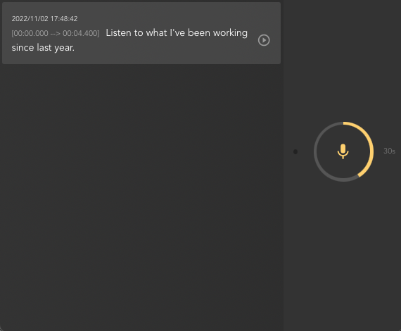
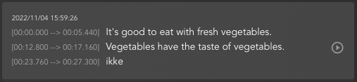
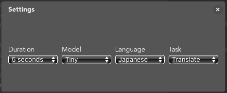

openai-whisper
===========

This is a sample webapp implementation of [OpenAI Whisper](https://openai.com/blog/whisper/), an automatic speech recognition (ASR) system, using [Next.JS](https://nextjs.org/).

It records audio data automatically and uploads the audio data to the server for transcribing/translating then sends back the result to the front end.
It is also possible to playback the recorded audio to verify the output.

> **Update:** If you want to use `Next 13` with experimental feature enabled (appDir), please check [openai-whisper-api](https://github.com/supershaneski/openai-whisper-api/) instead. Just set the flag to use whisper python module instead of whisper API.

---

* Using `OpenAI` [Speech to Text API](https://platform.openai.com/docs/guides/speech-to-text), please check [openai-whisper-api](https://github.com/supershaneski/openai-whisper-api/)

* If you are looking for voice-chat app using `Whisper`, please check [openai-whisper-talk](https://github.com/supershaneski/openai-whisper-talk/).

* For `Nuxt.js` version, please check [openai-chatterbox](https://github.com/supershaneski/openai-chatterbox/).

# Motivation

It has been said that `Whisper` itself is [not designed to support ***real-time*** streaming tasks per se](https://github.com/openai/whisper/discussions/2) but it does not mean we cannot try, vain as it may be, lol.

So this project is my attempt to make an ***almost real-time*** transcriber web application using openai `Whisper`.
The efficacy of which depends on how fast the server can transcribe/translate the audio.

I used `Next.js` so that I do not have to make separate backend and frontend apps.

As for the backend, I used `exec` to execute shell command invoking `Whisper`.
I have not yet find a way to `import` it as a `node.js` module.
All examples with `import` seem to be using `python` server.

```javascript
import { exec } from 'child_process'

exec(`whisper './${filename}' --model tiny --language Japanese --task translate`, (err, stdout, stderr) => {
    if (err) {
        console.log(err)
    } else {
        console.log(stdout)
        console.log(stderr)
    }
})
```

Notice I am just using the `tiny` model to perform super fast transcribing task.
This is all my system can handle otherwise it will come to a stand still.

## The App



I changed the behavior of the app from previous version.
Before, the app will record audio data continuously by some time interval, by default 5s.
Right now, it will only start recording if it can detect sound.

There is a threshold setting to eliminate background noise from triggering the audio capture. 
By default it is set to `-45dB` (0dB is the loudest sound). 
Adjust the variable `minDecibels` in `Settings` if you want to set it to lower or higher depending on your needs.

In normal human conversation, it is said that we tend to pause, on average, around 2 seconds between each sentences. Keeping this in mind, if sound is not detected for more than 2 seconds, recording will stop and the audio data will be sent to the backend for transcribing.
You can change this by editing the value of `maxPause`, by default set to `2500ms`.



It is possible to play the uploaded audio and follow the text output since the time period is shown.

As for the code itself, I used `class component` (I know, I know...) because I had a difficult time to access `state variables` using hooks when I was developing.



Aside from `minDecibels` and `maxPause`, you can also change several `Whisper` options such as `language`, `model` and `task` from the `Settings` dialog. Please check [Whisper's github repository](https://github.com/openai/whisper) for the explanation on the options.

There are still lots of things to do so this project is still a work in progress...

# Setup

First, you need to install [`Whisper`](https://github.com/openai/whisper) and its `Python`      dependencies

```sh
$ pip install git+https://github.com/openai/whisper.git
```

You also need `ffmpeg` installed on your system

```sh
# macos
$ brew install ffmpeg

# windows using chocolatey
$ choco install ffmpeg

# windows using scoop
$ scoop install ffmpeg
```

By this time, you can test `Whisper` using command line

```sh
$ whisper myaudiofile.ogg --language Japanese --task translate
```

If that is successful, you can proceed to install this app.

Clone the repository and install the dependencies

```sh
$ git clone https://github.com/supershaneski/openai-whisper.git myproject

$ cd myproject

$ npm install

$ npm run dev
```

Open your browser to `http://localhost:3006/` to load the application page.

## Using HTTPS

You might want to run this app using `https` protocol.
This is needed if you want to use a separate device for audio capture and use your machine as server.

In order to do so, prepare the proper `certificate` and `key` files and edit `server.js` at the root directory.

Then run

```sh
$ node server.js
```

Now, open your browser to `https://localhost:3006/` to load the page.

